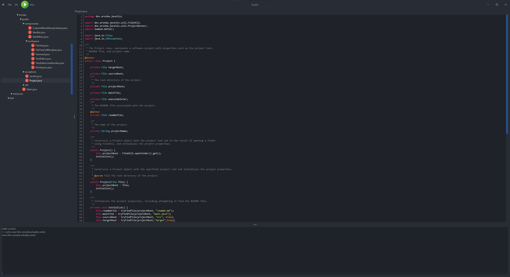

# Javelin
Very good IDE (I'm terrible at writing Swing components)

## todo/features

---
### done
- [x] texteditor
- [x] syntaxhighliting
- [x] filetree
- [x] open projects
- [X] console
---
### must haves
- [ ] actually running shit
- [ ] git integration
- [ ] unit tests
- [ ] logging
- [ ] exceptionHandling_
---
### nice to have
- [ ] add more icons
- [ ] fix projectTree order -> directories to the top
---
### Ideas
- [ ] HTML/Markdown support
- [ ] settings/prefrences
- [ ] multiple open files
- [ ] vim shortcuts
- [ ] auto complete
- [ ] Junit Integration
- [ ] QuestLab support?
- [ ] debugger (never)

## How to Run
- don't
